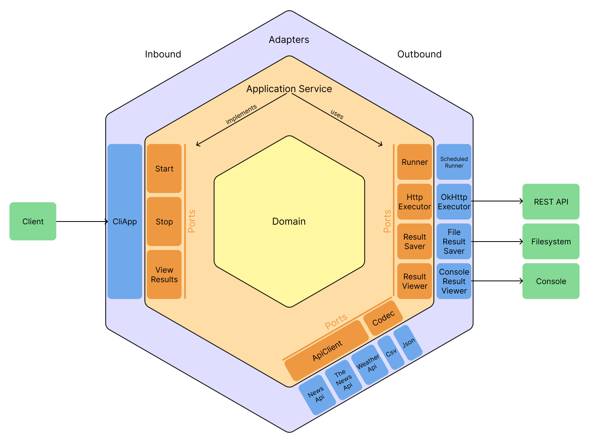

# Java REST aggregator

---

Console Java app for REST API data aggregation

---

### Build:

```shell
./gradlew clean build
```

### Run:

```shell
java -jar dist/app.jar --params
```

### Available params:

`--interactive` - interactive mode

`--format [csv|json]` - output format

`--mode [new|append]` - clear existing contents or append to it

`--path [path/file.ext]` - path to the output file (default: `out.{selectedFormat}`)

`--apis [api1 api2 ...]` - list of the APIs. Currently available: `weatherapi`, `newsapi`, `thenewsapi`

`--params [api1.param1=val1 api2.param1=val2 ...]` - list of the params you want to set for APIs

`--max-concurrent [quantity]` - maximum amount of tasks which can be executed at the same time

`--interval [duration]` - querying interval in seconds

`--duration [duration]` - total time after which aggregation is stopped in seconds

---

### Project architecture

